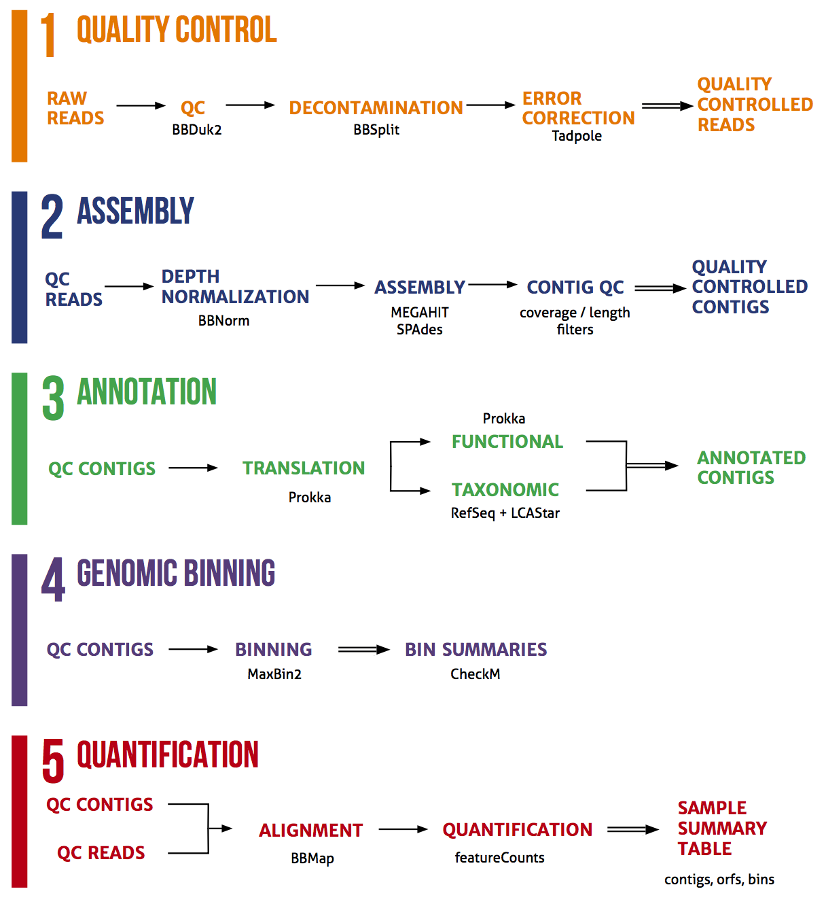

# ATLAS

[](https://zenodo.org/badge/latestdoi/75199304)




# Documentation

[](http://pnnl-atlas.readthedocs.io/en/latest/?badge=latest)

# Install

All dependencies are installed via [conda](https://www.continuum.io/downloads) using the [bioconda](https://github.com/bioconda/bioconda-recipes) channel.
The workflow and some dependencies require Python 3.

The intended usage requires `conda`.

Further dependencies will be installed on the first execution of the assembly
or annotation protocol and re-used on subsequent executions of the protocols.

For more information related to bioconda, see: https://bioconda.github.io/

## As a New Environment

With `conda`, execute:

```
conda create -n atlas -c bioconda python=3.6 \
    snakemake bbmap=37.78 click ruamel.yaml
```

Load the environment:

```
source activate atlas
```

Install `atlas`:

```
pip install -U pnnl-atlas
```

## In the Same Environment

```
conda install -c bioconda python=3.6 \
    snakemake bbmap=37.78 click ruamel.yaml
pip install -U pnnl-atlas
```

# Getting Started

After installing, one needs to download the required databases and create a sample configuration file.


## Databases

To download the databases and their respective metadata databases:

```
atlas download -o ~/databases
```

The downloads use approximately 30 GB of disk space.


## Configuration File

To create a configuration file run:

```
atlas make-config --database-dir ~/databases \
    config.yaml ~/directory_with_fastqs
```

Sample names and file paths along with default settings will populate
config.yaml. This [YAML](http://www.yaml.org/start.html) file can be updated
with any text editor.

Sample names should be A-Z characters and can be dash ("-") delimited.

For complete documentation, please see: [](http://pnnl-atlas.readthedocs.io/en/latest/?badge=latest)


## Assembly

After editing your configuration file and adjusting any additional parameters
we run assemblies across our samples using:

```
atlas assemble config.yaml
```

By default, this will write results into our current working directory across
the total number of CPU cores available.

# License

BSD-3.

# Disclaimer

This material was prepared as an account of work sponsored by an agency of the
United States Government.  Neither the United States Government nor the United
States Department of Energy, nor Battelle, nor any of their employees, nor any
jurisdiction or organization that has cooperated in the development of these
materials, makes any warranty, express or implied, or assumes any legal
liability or responsibility for the accuracy, completeness, or usefulness or
any information, apparatus, product, software, or process disclosed, or
represents that its use would not infringe privately owned rights.

Reference herein to any specific commercial product, process, or service by
trade name, trademark, manufacturer, or otherwise does not necessarily
constitute or imply its endorsement, recommendation, or favoring by the United
States Government or any agency thereof, or Battelle Memorial Institute. The
views and opinions of authors expressed herein do not necessarily state or
reflect those of the United States Government or any agency thereof.

PACIFIC NORTHWEST NATIONAL LABORATORY operated by BATTELLE for the UNITED
STATES DEPARTMENT OF ENERGY under Contract DE-AC05-76RL01830
