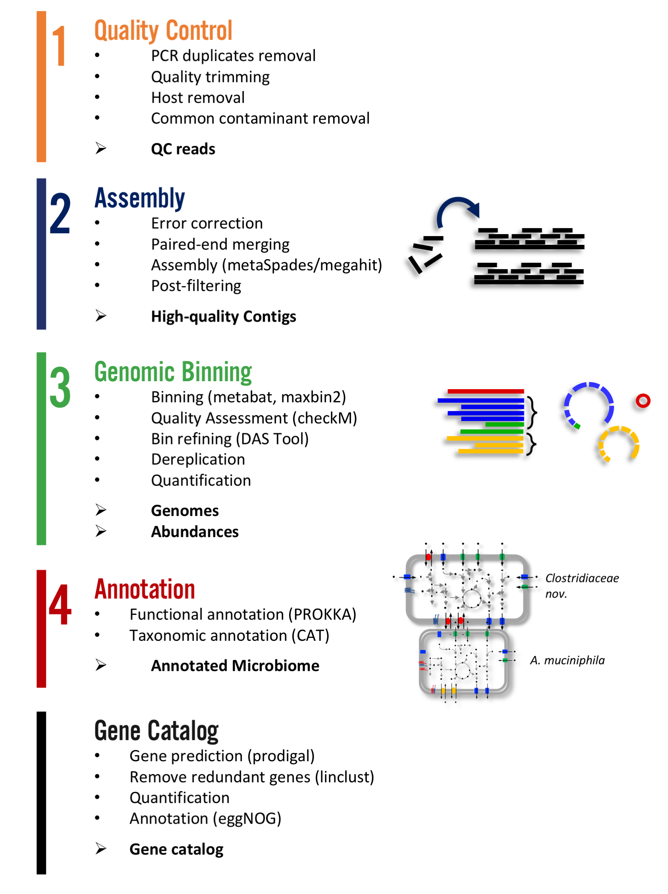

The Atlas pipeline
==================

|scheme|



Expected output
===============

Quality control
---------------

::

  atlas run qc
  #or
  atlas run all


Runs quality control of single or paired end reads and summarizes the main QC stats in
`reports/QC_report.html`_.

.. _reports/QC_report.html: ../_static/QC_report.html

Per sample it generates:

  - ``{sample}/sequence_quality_control/{sample}_QC_{fraction}.fastq.gz``
  - Various quality stats in {sample}/sequence_quality_control/read_stats

.. _fractions:

Fractions:
``````````
When the input was paired end, we will put out three the reads in three fractions R1,R2 and se
The se are the paired end reads which lost their mate during the filtering.
The se are seamlessly integrated in the next steps.


Assembly
---------------

::

  atlas run assembly
  #or
  atlas run all


Besides the `reports/assembly_report.html`_ this rule outputs the following files per sample:

  - ``{sample}/{sample}_contigs.fasta``
  - ``{sample}/sequence_alignment/{sample}.bam``
  - ``{sample}/assembly/contig_stats/final_contig_stats.txt``


.. _reports/assembly_report.html: ../_static/assembly_report.html


Binning
---------------
::

  atlas run binning
  #or
  atlas run all

When you use different binners (e.g. metabat, maxbin) and a binner-reconciliator (e.g. DAS Tool),
then Atlas will produce for each binner and sample:

  - ``{sample}/binning/{binner}/cluster_attribution.tsv``

which shows the attribution of contigs to bins. For the final_binner it produces the

  - ``reports/bin_report_{binner}.html``

See an `example <../_static/bin_report.html>`_ as a summary of the quality of all bins.


Genomes
---------------
::

    atlas run genomes
    #or
    atlas run all

As the binning can predict several times the same genome it is recommended to de-replicate these genomes.
For now we use DeRep to filter and de-replicate the genomes.
The Metagenome assembled genomes are then renamed, but we keep mapping files.

      - ``genomes/Dereplication``
      - ``genomes/clustering/contig2genome.tsv``
      - ``genomes/clustering/allbins2genome.tsv``

The fasta sequence of the dereplicated and renamed genomes can be found in ``genomes/genomes``
and their quality estimation are in ``genomes/checkm/completeness.tsv``.
The quantification of the genomes can be found in:

  - ``genomes/counts/median_coverage_genomes.tsv``
  - ``genomes/counts/raw_counts_genomes.tsv``

See in `Atlas example <https://github.com/metagenome-atlas/Atlas_example>`_ how to analyze these abundances.

The predicted genes and translated protein sequences are in ``genomes/annotations/genes``.

Taxonomic adnnotation
`````````````````````
::

  annotations:
    - gtdb_tree
    - gtdb_taxonomy
    - checkm_tree
    - checkm_taxonomy

Different annotations can be turned on and off in the config file under the heading ``annotations``:
A taxonomy for the dereplicated genomes is proposed GTDB.
The results can be found in ``genomes/taxonomy``.
The genomes are placed in a phylogenetic tree separately for bacteria and archaea (if there are any) using the GTDB markers.
In addition a tree for bacteria and archaea can be generated based on the checkm markers.
All trees are properly rooted using the midpoint. The files can be found in ``genomes/tree``


Gene Catalog
---------------

::

  atlas run all
  # or
  atlas run genecatalog

The gene catalog takes either genes predicted from the genomes or all genes predicted on the contigs and clusters them
according to the configuration.
This rule produces the following output file for the whole dataset.

  - ``Genecatalog/gene_catalog.fna``
  - ``Genecatalog/gene_catalog.faa``
  - ``Genecatalog/annotations/eggNog.tsv.gz``
