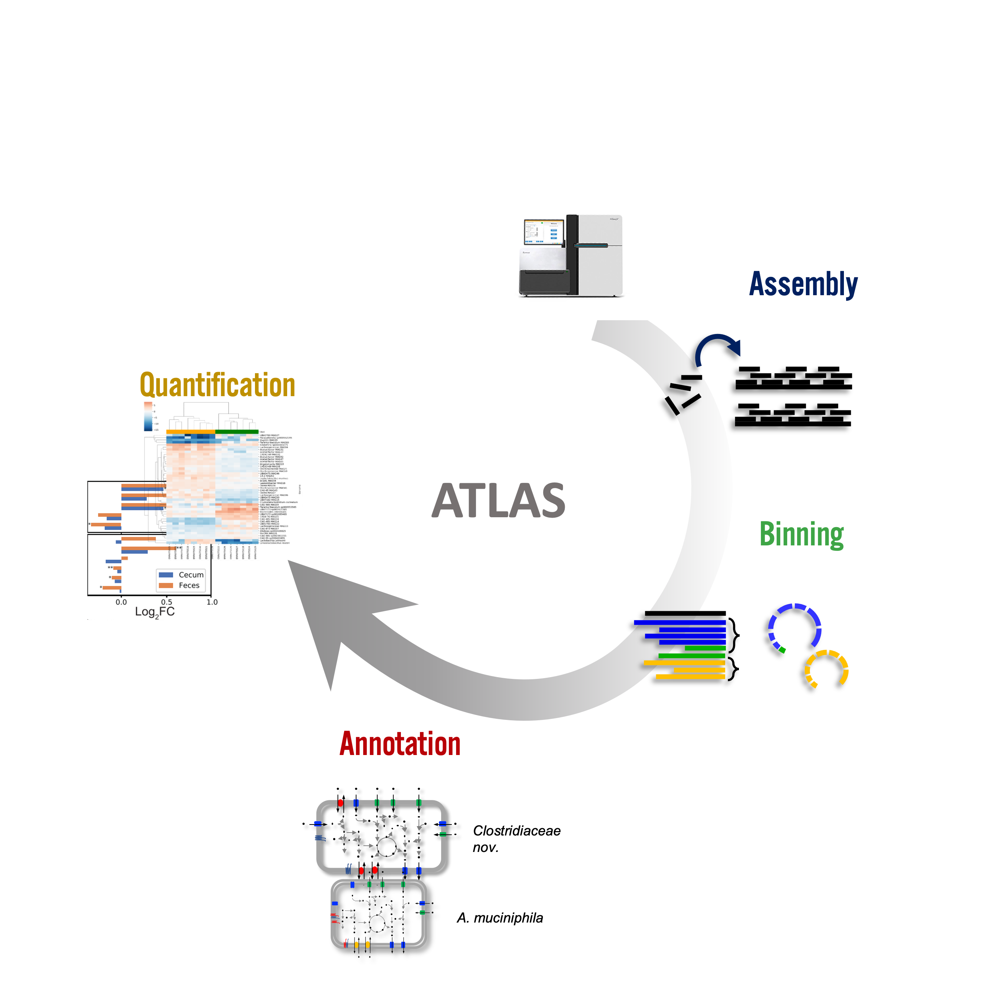

.. image:: https://anaconda.org/bioconda/metagenome-atlas/badges/version.svg
    :target: https://anaconda.org/bioconda/metagenome-atlas

.. image:: https://img.shields.io/conda/dn/bioconda/metagenome-atlas.svg?label=Bioconda
    :target: https://bioconda.github.io/recipes/metagenome-atlas/README.html

.. image:: https://img.shields.io/twitter/follow/SilasKieser.svg?style=social&label=Follow
    :target: https://twitter.com/search?f=tweets&q=%40SilasKieser%20%23metagenomeAtlas&src=typd

Metagenome-Atlas
****************

|logo|

Metagenome-Atlas is a easy-to-use metagenomic pipeline based on `snakemake <https://snakemake.github.io/>`_.
It handles all steps from QC, Assembly, Binning, to Annotation.

You can start using atlas with three commands::

      mamba install -c bioconda -c conda-forge metagenome-atlas={latest_version}
      atlas init --db-dir databases path/to/fastq/files
      atlas run

where `{latest_version}` should be replaced by 

.. image:: https://anaconda.org/bioconda/metagenome-atlas/badges/version.svg
    :target: https://anaconda.org/bioconda/metagenome-atlas

.. _publication:

Publication
===========

    ATLAS: a Snakemake workflow for assembly, annotation, and genomic binning of metagenome sequence data.
    Kieser, S., Brown, J., Zdobnov, E. M., Trajkovski, M. & McCue, L. A.
    BMC Bioinformatics 21, 257 (2020).
    doi: `10.1186/s12859-020-03585-4 <https://bmcbioinformatics.biomedcentral.com/articles/10.1186/s12859-020-03585-4>`_

.. toctree::
    :maxdepth: 2
    :caption: Documentation

    usage/getting_started
    usage/output
    usage/configuration
    usage/changelog
