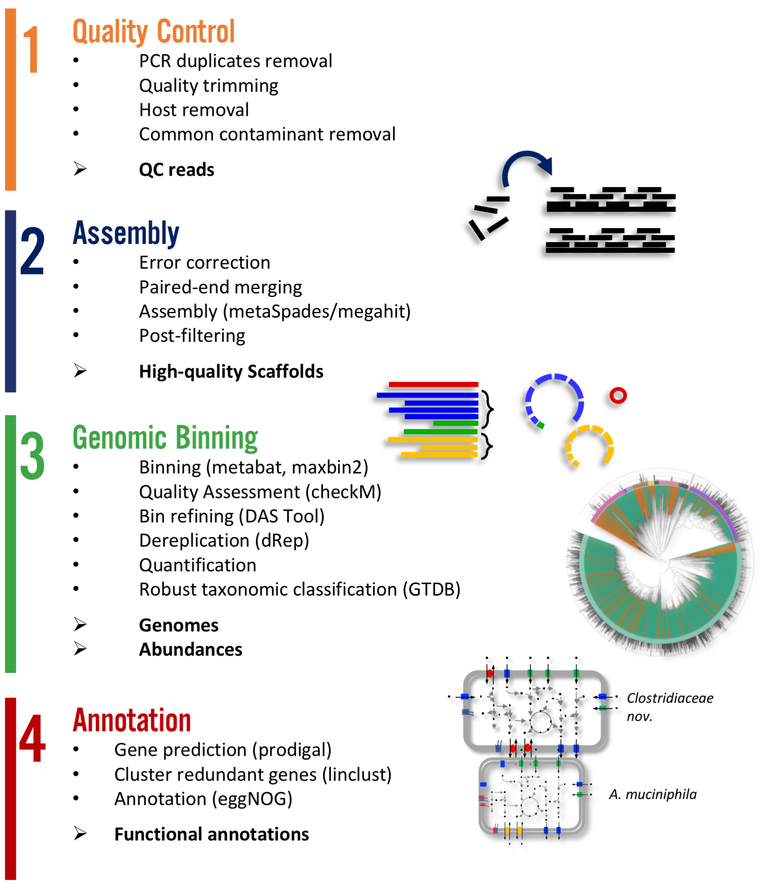

Expected output
***************

|scheme|

There are two main workflows implemented in atlas. A. *Genomes* and B. *Genecatalog*. The first aims in producing metagenome assembled genomes (MAGs) where as the later produces a gene catalog. The steps of Quality control and and

.. note:: Have a look at the example output at `<https://github.com/metagenome-atlas/Tutorial/Example>`_ .

Quality control
===============

::

  atlas run qc
  # or
  atlas run genomes
  # or
  atlas run genecatalog

Runs quality control of single or paired end reads and summarizes the main QC stats in
`reports/QC_report.html`_.

.. _reports/QC_report.html: ../_static/QC_report.html

Per sample it generates:

  - ``{sample}/sequence_quality_control/{sample}_QC_{fraction}.fastq.gz``
  - Various quality stats in ``sample}/sequence_quality_control/read_stats``

.. _fractions:

Fractions:
----------
When the input was paired end, we will put out three the reads in three fractions R1,R2 and se
The se are the paired end reads which lost their mate during the filtering.

The se reads are no longer used as they usually represent an insignificant number of reads.

Assembly
===============

::

  atlas run assembly
  #or
  atlas run genomes
  # or
  atlas run genecatalog

Besides the `reports/assembly_report.html`_ this rule outputs the following files per sample:

  - ``{sample}/{sample}_contigs.fasta``
  - ``{sample}/sequence_alignment/{sample}.bam``
  - ``{sample}/assembly/contig_stats/final_contig_stats.txt``

.. _reports/assembly_report.html: ../_static/assembly_report.html

Binning
===============
::

  atlas run binning
  #or
  atlas run genomes

When you use different binners (e.g. metabat, maxbin) and a bin-reconciliator (e.g. DAS Tool),
then Atlas will produce for each binner and sample:

  - ``{sample}/binning/{binner}/cluster_attribution.tsv``

which shows the attribution of contigs to bins. For the final_binner it produces the

  - ``reports/bin_report_{binner}.html``

See an `example <../_static/bin_report.html>`_ as a summary of the quality of all bins.

.. seealso:: In version 2.8 the new binners *vamb* and *SemiBin* were added. First experience show that they outperform the default binner (metabat, maxbin + DASTool). They use a new approach of co-binning which uses the co-abundance from different samples. For more information see the `detailed explanation <https://silask.github.io/post/phd-thesis/Thesis_Silas_Kieser.pdf> on page 14`_

.. note:: Keep also in mind that maxbin, DASTool, and SemiBin are biased for prokaryotes. If you want to try to bin (small) Eukaryotes use metabat or vamb. More information about Eukaryotes see `the discussion here <https://github.com/metagenome-atlas/atlas/discussions/427>`_.

Genomes
===============
::

    atlas run genomes

Binning can predict several times the same genome from different samples. To remove this reduncancy we use DeRep to filter and de-replicate the genomes. By default the threshold is set to **97.5%**, which corresponds somewhat to the *sub-species level*. The best quality genome for each cluster is choosen as the representative for each cluster. The represenative MAG are then renamed and used for annotation and quantification.

The fasta sequence of the dereplicated and renamed genomes can be found in ``genomes/genomes``
and their quality estimation are in ``genomes/checkm/completeness.tsv``.

Quantification
--------------

The quantification of the genomes can be found in:

  - ``genomes/counts/median_coverage_genomes.tsv``
  - ``genomes/counts/raw_counts_genomes.tsv``

.. seealso:: See in `Atlas example <https://github.com/metagenome-atlas/Tutorial>`_ how to analyze these abundances.

Annotations
-----------

The annotation can be turned of and on in the config file::

  annotations:
    - genes
    - gtdb_tree
    - gtdb_taxonomy
    - kegg_modules
    - dram

The ``genes`` option produces predicted genes and translated protein sequences which are stored in ``genomes/annotations/genes``.

**Taxonomic adnnotation**

A taxonomy for the genomes is proposed by the Genome `Taxonomy database <https://gtdb.ecogenomic.org/>`_ (GTDB).
The results can be found in ``genomes/taxonomy``.
The genomes are placed in a phylogenetic tree separately for bacteria and archaea using the GTDB markers.

In addition a tree for bacteria and archaea can be generated based on the checkm markers.
All trees are properly rooted using the midpoint. The files can be found in ``genomes/tree``

**Functional annotation**

Sicne version 2.8, We use `**DRAM** <https://github.com/shafferm/DRAM>`_ to annotate the genomes with Functional annotations, e.g. KEGG and CAZy as well as to **infere pathways**, or more specifically Kegg modules.

The Functional annotations for each genome can be found in ``genomes/annotations/dram/``

and are contain the following files:

 - ``kegg_modules.tsv`` Table of all Kegg modules
 - ``annotations.tsv`` Table of all annotations
 - ``distil/metabolism_summary.xlsx`` Excel of the summary of all annotations

 The tool alos produces a nice report in `distil/product.html`_.

.. _distil/product.html: ../_static/dram_product.html

Gene Catalog
===============

::

  atlas run all
  # or
  atlas run genecatalog

The gene catalog takes all genes predicted from the contigs and clusters them
according to the configuration. It quantifies them by simply mapping reads to the genes (cds sequences) and annotates them using EggNOG mapper.

This rule produces the following output file for the whole dataset.

  - ``Genecatalog/gene_catalog.fna``
  - ``Genecatalog/gene_catalog.faa``
  - ``Genecatalog/annotations/eggNog.tsv.gz``
  - ``Genecatalog/counts/``

All
===

The option of ``atlas run all`` runs both Genecatalog and Genome workflows and creates mapping tables between Genecatalog and Genomes. However, in future the two workflows are expected to diverge more and more to fulfill their aim better.

If you want to run both workflows together you can do this by::

  atlas run genomes genecatalog

If you are interested in mapping the genes to the genomes see the discussion at https://github.com/metagenome-atlas/atlas/issues/413
